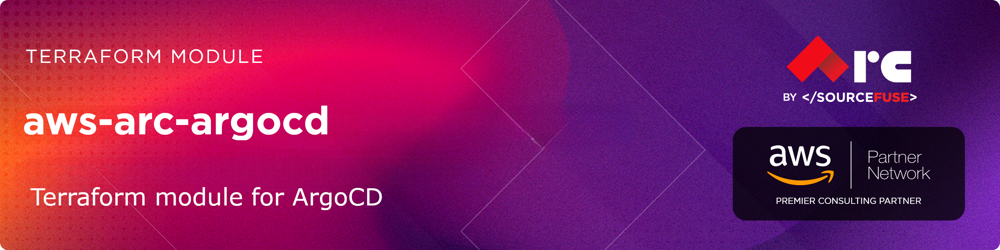

# [terraform-aws-arc-argocd](https://github.com/sourcefuse/terraform-aws-arc-argocd)

> **Module:** `sourcefuse/arc-argocd/aws`

> **Registry:** [https://registry.terraform.io/modules/sourcefuse/arc-argocd/aws](https://registry.terraform.io/modules/sourcefuse/arc-argocd/aws)

> **Category:** DevOps / GitOps


> **Source:** [https://github.com/sourcefuse/terraform-aws-arc-argocd](https://github.com/sourcefuse/terraform-aws-arc-argocd)

[](https://github.com/sourcefuse/terraform-aws-arc-argocd/releases/latest)
[](https://github.com/sourcefuse/terraform-aws-arc-argocd/commits)


[](https://sonarcloud.io/summary/new_code?id=sourcefuse_terraform-aws-arc-argocd)

## Overview

Deploys ArgoCD on an existing EKS cluster with ALB ingress, ACM certificates, Route53 DNS, and IRSA.

## What It Does

- ArgoCD Helm release with configurable version
- ALB ingress with ACM certificate (auto-created or existing)
- Route53 A record auto-creation
- IRSA for least-privilege AWS access
- High-availability mode with configurable replicas
- ArgoCD Image Updater for automated image updates
- SSO via Dex (GitHub, OIDC, SAML)
- Repositories, projects, and applications as code

## Quickstart

```hcl
module "argocd" {
  source = "sourcefuse/arc-argocd/aws"

  namespace   = "myapp"
  environment = "prod"

  eks_cluster_name = "my-eks-cluster"

  argocd_config = {
    enable  = true
    version = "7.8.13"

    helm_release_set_values = [
      {
        name  = "configs.cm.url"
        value = "https://argocd.example.com"
      },
      {
        name  = "configs.params.server\.insecure"
        value = "true"
      }
    ]
  }

  ingress_config = {
    enable                     = true
    host                       = "argocd.example.com"
    ingress_class_name         = "alb"
    create_acm_certificate     = true
    auto_create_route53_record = true
    route53_zone_name          = "example.com"
    alb_subnets                = ["subnet-xxxxx", "subnet-yyyyy"]
  }

  irsa_config = {
    enable = true
  }

  tags = {
    Project   = "myapp"
    ManagedBy = "terraform"
  }
}
```
### With Existing Certificate
```hcl
module "argocd" {
  source = "sourcefuse/arc-argocd/aws"

  # ... other configuration ...

  ingress_config = {
    enable              = true
    host                = "argocd.example.com"
    acm_certificate_arn = "arn:aws:acm:us-east-1:123456789:certificate/xxxxx"
  }
}
```
### High Availability Configuration
```hcl
module "argocd" {
  source = "sourcefuse/arc-argocd/aws"

  # ... other configuration ...

  ha_config = {
    enable               = true
    server_replicas      = 3
    repo_server_replicas = 2
    controller_replicas  = 1
  }
}
```
### With ArgoCD Resources (Repositories, Projects, Applications)
```hcl
module "argocd" {
  source = "sourcefuse/arc-argocd/aws"

  namespace   = "myapp"
  environment = "prod"

  eks_cluster_name = "my-eks-cluster"

  argocd_config = {
    enable  = true
    version = "7.8.13"
  }

  # Define repositories
  repositories = {
    "my-private-repo" = {
      url      = "https://github.com/myorg/myrepo"
      type     = "git"
      username = "git"
      password = var.github_token
    }
    "my-helm-repo" = {
      url  = "https://charts.example.com"
      type = "helm"
    }
  }

  # Define projects
  projects = {
    "production" = {
      description  = "Production applications"
      source_repos = ["https://github.com/myorg/*"]
      destinations = [
        {
          namespace = "prod-*"
          server    = "https://kubernetes.default.svc"
        }
      ]
    }
  }

  # Define applications
  applications = {
    "my-app" = {
      repo_url        = "https://github.com/myorg/myrepo"
      target_revision = "main"
      path            = "k8s/overlays/prod"
      project         = "production"
      destination = {
        namespace = "prod-apps"
        server    = "https://kubernetes.default.svc"
      }
      sync_policy = {
        automated = {
          prune     = true
          self_heal = true
        }
        sync_options = ["CreateNamespace=true"]
      }
    }
    "my-helm-app" = {
      repo_url        = "https://charts.example.com"
      target_revision = "1.0.0"
      path            = "my-chart"
      project         = "production"
      destination = {
        namespace = "prod-apps"
      }
      helm = {
        release_name = "my-release"
        parameters = [
          {
            name  = "image.tag"
            value = "v1.0.0"
          }
        ]
      }
      sync_policy = {
        automated = {
          prune     = true
          self_heal = true
        }
      }
    }
  }

  tags = {
    Project   = "myapp"
    ManagedBy = "terraform"
  }
}
```

```hcl
   module "argocd" {
     source  = "sourcefuse/arc-argocd/aws"
     version = "2.0.0"  # New version
   }
```

## Required Inputs

| Name | Type | Description |
|------|------|-------------|
| `namespace` | `string` | Namespace prefix for resource names |
| `environment` | `string` | Deployment environment |
| `eks_cluster_name` | `string` | Name of the existing EKS cluster |
## Key Outputs

| Name | Description |
|------|-------------|
| `argocd_server_url` | ArgoCD UI URL |
| `acm_certificate_arn` | ACM certificate ARN |
| `server_iam_role_arn` | IRSA role ARN for ArgoCD server |
## Full Variable & Output Reference

The complete inputs/outputs reference is auto-generated below.


## Contributing

See [CONTRIBUTING.md](./CONTRIBUTING.md) for commit conventions and development setup.

## Authors
This project is authored by:
- SourceFuse ARC Team

